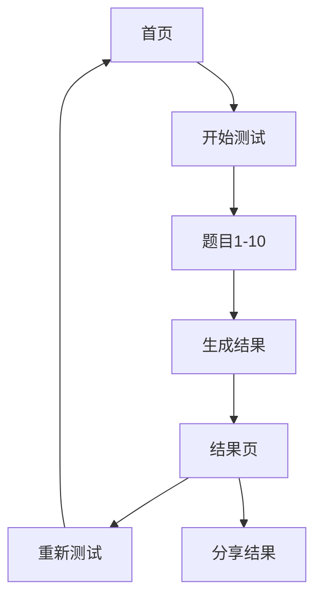

## 1. Product Overview
LBTI（League of Legends Personality Test）是一款基于英雄联盟的互动式趣味人格测试工具，通过10道选择题分析用户的性格特点，匹配到8种不同的英雄联盟角色人格类型。
- 目标是为英雄联盟玩家提供娱乐性的自我认知工具，通过社交分享实现裂变传播
- 市场价值在于创造高传播性的轻量级应用，适合社交媒体分享

## 2. Core Features

### 2.1 User Roles
无需用户注册，所有功能对访客开放。

### 2.2 Feature Module
1. **首页/介绍页**：展示应用介绍、开始测试按钮
2. **测试页**：10道选择题，逐题作答，进度显示
3. **结果页**：展示测试结果、人格详细分析、分享按钮

### 2.3 Page Details
| Page Name | Module Name | Feature description |
|-----------|-------------|---------------------|
| 首页 | Hero section | 引人注目的标题、简短介绍、开始测试按钮 |
| 测试页 | 题目区域 | 显示当前题目、选项选择、进度条、上一题/下一题按钮 |
| 结果页 | 结果展示 | 人格类型名称、对应的英雄联盟角色、详细分析文案、重新测试和分享按钮 |

## 3. Core Process
用户访问应用 → 阅读介绍 → 开始测试 → 逐题作答10道选择题 → 查看测试结果和详细分析 → 选择重新测试或分享给好友

## 4. User Interface Design
### 4.1 Design Style
- 主色调：英雄联盟主题色，深蓝色（#0A1428）搭配紫色（#7B68EE）
- 辅助色：金色（#FFD700）用于强调
- 按钮风格：圆角大按钮，有轻微阴影和悬停效果
- 字体：使用现代无衬线字体，标题用更大字号和粗体
- 布局风格：卡片式布局，居中对齐
- 视觉风格：游戏感强烈，适合英雄联盟主题
- 图标风格：使用英雄联盟相关的图标，简洁现代

### 4.2 Page Design Overview
| Page Name | Module Name | UI Elements |
|-----------|-------------|-------------|
| 首页 | Hero section | 渐变背景，英雄联盟元素，大标题，简介文本，CTA按钮，流畅的进入动画 |
| 测试页 | 题目区域 | 进度条，题号显示，题目卡片，选项按钮组，上一题/下一题导航，平滑过渡动画 |
| 结果页 | 结果展示 | 人格类型大标题，对应英雄联盟角色，详细描述卡片，分享按钮，重新测试按钮，庆祝动画效果 |

### 4.3 Responsiveness
- 移动端优先设计，适配各种屏幕尺寸
- 在小屏设备上优化触摸交互
- 响应式布局，确保在手机、平板和桌面端都有良好体验

### 4.4 8种人格类型命名
1. 疾风剑豪亚索（帅哥）
2. 披甲龙龟（敦厚）
3. 小鱼人菲兹（古灵精怪）
4. 死亡颂唱者·卡尔萨斯（阴暗）
5. 暗夜猎手薇恩（意志坚定）
6. 齐天大圣孙悟空（阳光开朗不服输）
7. 九尾妖狐阿狸（美丽性感）
8. 弗雷尔卓德之心布隆（可靠的朋友）
